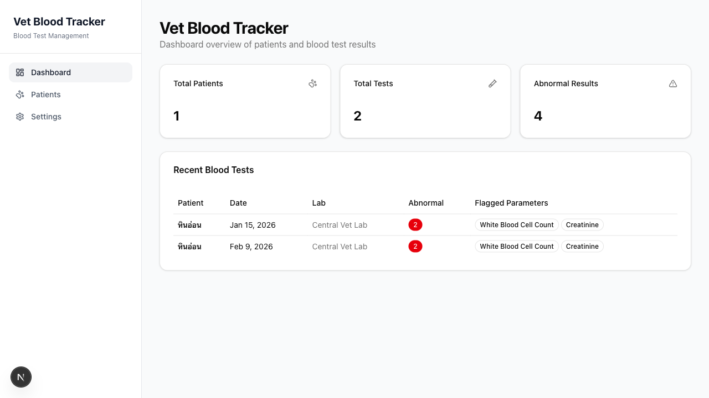
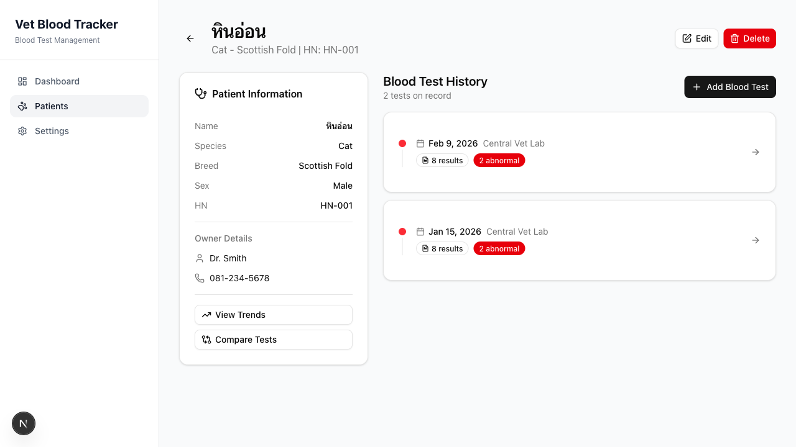
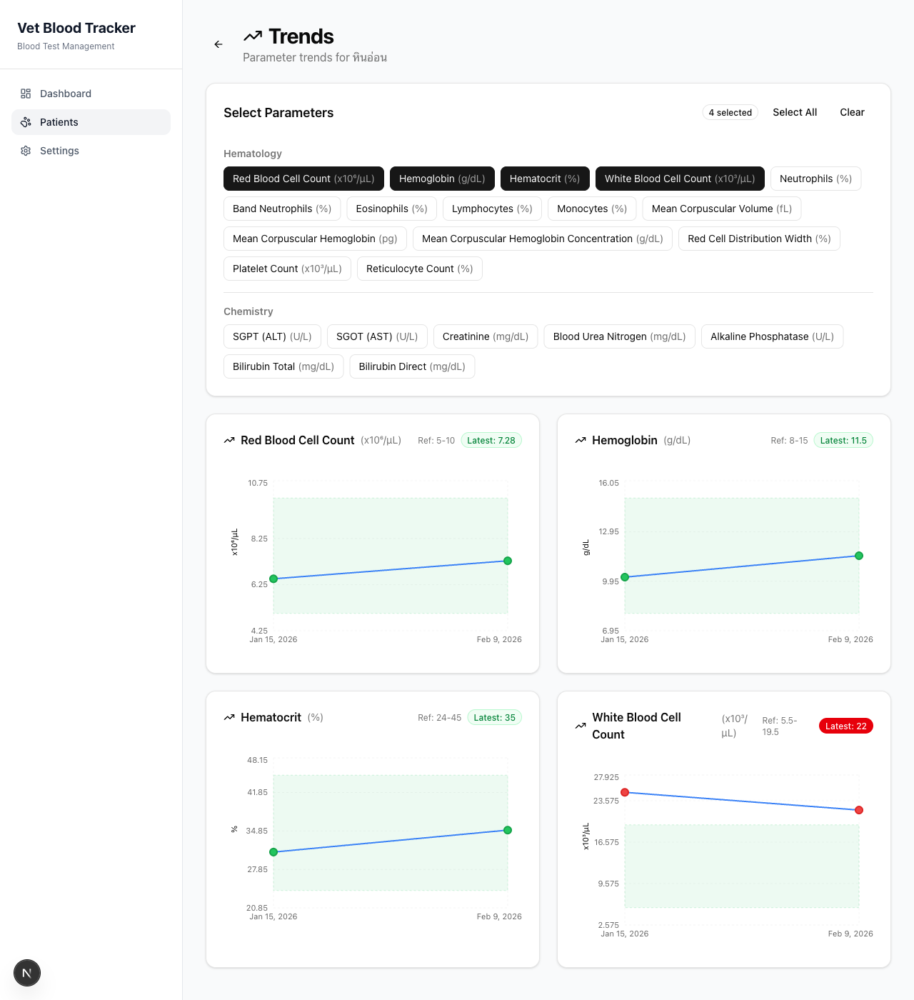
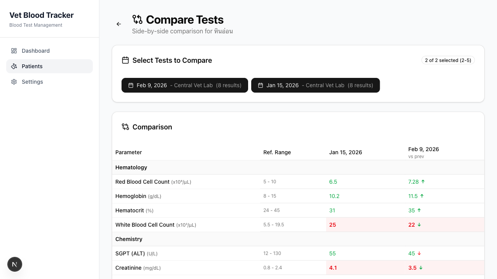

# VetBlood AI - Animal Blood Test Analyzer

An open-source AI-powered app for Thai veterinary clinics that digitizes animal blood test results and compares them across visits, replacing manual entry with smart analysis and trend tracking.

**Built for the Gemini 3 Hackathon**



## Features

- **Patient Management** - Track dogs, cats, and other animals with full medical profiles
- **AI-Powered OCR** - Upload blood test images and extract values automatically using **Google Gemini 2.0 Flash** vision or free Tesseract.js (supports Thai + English lab reports)
- **Auto Flagging** - Automatically flags abnormal values (HIGH/LOW) using species-specific reference ranges (dog vs cat)
- **Trend Charts** - Visualize parameter changes over time with reference range bands
- **Side-by-Side Comparison** - Compare 2-5 test dates with delta arrows showing improvement/worsening
- **Dashboard** - Overview of patients, recent tests, and abnormal result counts

## Screenshots

| Patient Detail | Trend Charts | Compare View |
|---|---|---|
|  |  |  |

## Tech Stack

- **Framework:** Next.js 16 (App Router, Server Actions, React 19)
- **Language:** TypeScript
- **Database:** SQLite + Prisma ORM 7
- **AI OCR:** Google Gemini 2.0 Flash (vision) via `@google/generative-ai`
- **Free OCR:** Tesseract.js 7 + sharp (image preprocessing)
- **Charts:** Recharts 3
- **UI:** Tailwind CSS 4 + shadcn/ui + Radix UI

## Getting Started

### Prerequisites

- Node.js 18+
- npm

### Setup

```bash
# Clone the repo
git clone https://github.com/mingrath/vetblood-ai.git
cd vetblood-ai

# Install dependencies
npm install

# Set up the database
npx prisma migrate dev

# Seed reference parameters (23 blood test parameters with dog/cat ranges)
npx prisma db seed

# Start the dev server
npm run dev
```

Open [http://localhost:3000](http://localhost:3000)

### Configure Gemini API (Optional)

For AI-powered OCR, add your Google Gemini API key:

1. Get a free API key at [aistudio.google.com/apikey](https://aistudio.google.com/apikey)
2. Go to **Settings** in the app
3. Paste your API key and save

Without the API key, you can still use free Tesseract.js OCR or enter values manually.

## How It Works

```
Upload blood test image/PDF
         |
   Preprocess with sharp (grayscale, contrast, upscale)
         |
   +-----+-----+
   Free         Premium
   Tesseract    Gemini 2.0 Flash
   (tha+eng)    (structured JSON extraction)
   +-----+-----+
         |
   Pattern matching -> Extract parameter values
         |
   USER REVIEW (editable form, pre-filled with OCR values)
         |
   Save to database (auto-calculate flags vs reference ranges)
```

## Pre-seeded Blood Test Parameters

**Hematology (15):** RBC, Hemoglobin, Hematocrit, WBC, Neutrophils, Band, Eosinophils, Lymphocytes, Monocytes, MCV, MCH, MCHC, RDW, Platelet count, Reticulocyte count

**Chemistry (7):** ALT (SGPT), AST (SGOT), Creatinine, BUN, Alkaline Phosphatase, Total Bilirubin, Direct Bilirubin

**Parasitology (1):** Blood Parasites (qualitative)

Each parameter has separate dog and cat reference ranges.

## Project Structure

```
vet-blood-tracker/
+-- prisma/           # Schema, migrations, seed data
+-- src/
|   +-- app/          # Next.js App Router pages + Server Actions
|   +-- components/   # React components (patients, tests, charts, compare, settings)
|   +-- lib/
|       +-- db.ts     # Prisma client singleton
|       +-- flags.ts  # Flag calculation logic
|       +-- ocr/      # Gemini processor, Tesseract processor, pattern matcher
+-- uploads/          # Uploaded blood test images (gitignored)
+-- dev.db            # SQLite database (gitignored)
```

## License

MIT
